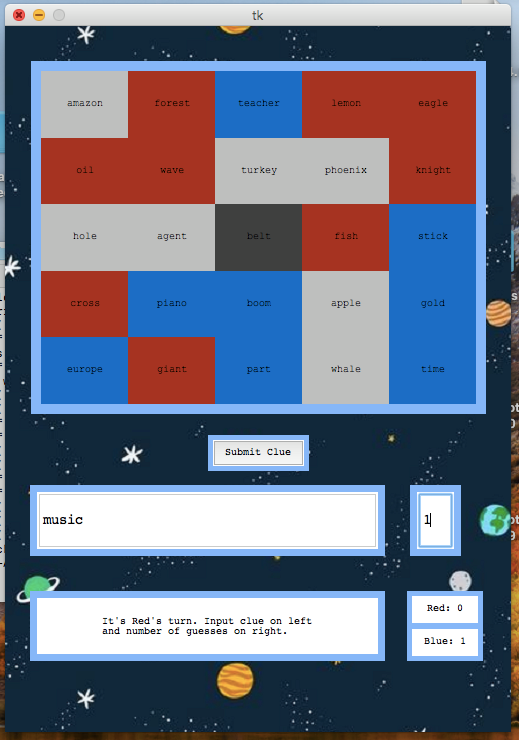

# Codenames Bot

This is a Codenames bot made by William Huang, Jonathan Sham, Michael Li, and Franklin Chian. It utilizes a pre-trained, deep learning word embedding model to predict relationships between words on the Codenames board. The bot can either give hints to the 2 users playing the game, or guess words from the board after being given hints from the user.

## Usage

The following packages are required for running this program. We apologize in advance for not using Piplock.
Required Commands:<br/>
```
pip install gensim
pip install inflect
pip install numpy
```


You must also download Google's DataSetGoogleNews at https://drive.google.com/file/d/0B7XkCwpI5KDYNlNUTTlSS21pQmM/edit?fbclid=IwAR2cGOoPhXxpTx0GSKLOp8xCbAVFWXcofbZ16NSeyZZ9rD0AOmFXr8M95bU. This file is 1.5 GB and contains Google's dataset of millions of sentences. Place this file in the root directory of this project.

To run the program, run `python codenamesbot.py`

Due to limitations of tkinter on MacOS, we recommend the use of Windows in running this program, as our UI choices were designed in a Windows environment. Nevertheless, our program will still run smoothly on MacOS.



